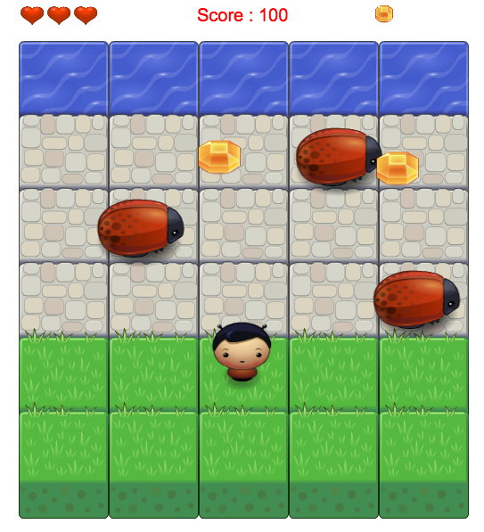

## Classic Arcade Game Project

### Contents:
1. [Description](#1-description).
2. [Instructions](#2-instructions).
3. [App page](#3-app-page).
4. [Dependencies](#4-dependencies).

## 1. Description
- This project is a part of Google/Udacity Front-end nanodegree projects.

## 2. Instructions
- To use the game You should visit Game page: https://inass-helmy.github.io/Arcade-Game-Project-ND/
- You could also run it _locally_ (on your machine) by downloading a zip format using this link https://github.com/inas-helmy/Arcade-Game-Project-ND/archive/master.zip. Then you will have to unzip it and open `index.html` file from your browser to start game.
- In this game you have a Player and Enemies (Bugs).
- The goal of the player is to reach the water and collect all Gems, without colliding into any one of the enemies.
- The player can move left, right, up and down. The enemies move in varying speeds on the paved block portion of the scene.
- Once the player collides with an enemy, one life decreased, the game is reset and the player moves back to the start square.
- Once the player reaches the water and collects all Gems the game is won.
- each collected Gem increase the score by 100 points and each time the player loses a life the score decreases by 50 points.

## 3. App page
- https://inass-helmy.github.io/Arcade-Game-Project-ND/

## 4. Dependencies
- Code is written in `HTML`, `CSS` and `JavaScript`.
